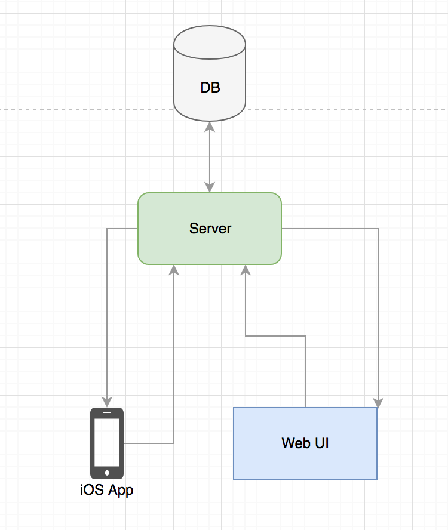

# Meetup Project

In this repo you should  find everything you need to run out Project. We might want to break the different components in different directories. For example the Web UI should be kept in the `front-end` directory, or the iOS App should be kept in the `iOS` directory. Then each subsequent part can organize the their own part as they see fit. 

# Purpose
The reason why we are doing this is because each contributor to this Project has mentioned that we should make something as a way to show off our skills, promote our Meetup, and learn new things. 

The problem this Prject aims to solve is to keept track of topics covered in a Meetup. The idea here is that we should be able to look back of the Meetups we had in the past and see what we talked about. If there were certain resources that we used to describe topics covered in a Meetup presentation then you should be able to find them as a part of this project. We also want the ability to ask questions durring a Meetup that is in progress. This could be durring a presentaion someone is giving, and we don't want to inturupt so we post it to the "thread" for the in progress Meetup, or we could post to the in progress Meetup thread a questions we have on a Project we are working on. There should be a for other people to comment on your questions, add links to your questions, etc. 

The main goal of this Project is to keep track of things we are working on, ask questions, and learn! We want to make it as easy as possible to share great ideas, spread tge knowledge we have, ask the questions we have, and show off all the cool things we are doing as a part of this Meetup

# Issue Tracking, and Maintenance
To keep track of bugs, new features, feature requests, etc we have decided to use the Guthub issues. This isn't set in stone, but as an inital attempt we will try it. If there are bugs found, or features you want to see add them to this repo! Also, for any new code, or code that fixes a bug open a Pull Request. As a rule lets make sure at least 2 people look over you code before the Pull Request is accepted and your code gets merged to the Project. 

# Architecture 

## iOS
The iOS App should do a few things
	- Allow User to view Meetups that have talken place in the past
	- Allow Users to `Join` Meetups that are in progress
	- Allow Users to post comments, questions, links, etc to in prgress Meetups
	- Allow Users to comment on Meetups from the past

## Server 
The Server component is responsible for a few things, and in MUST be in Swift 😎
	- Defines an API that the iOS App Communicates with
	- Handles data access for things like creating a comment, viewing a Meetup, etc
	- Provide analytics about the usage of our App, this COULD mean most commented on Topic, most viewed questions, etc

## DB - Database
The Database component is resposible for a few things
	- Store all useful information

## Web UI - Web User Interface
The Web UI should do a few things
	- Allow a User to view comments, questions, etc on in progress Meetups in real time
	- If signed in, a User could post thier own comments, questions, topics
	- Have a place that talks about exactly what we are building/built, think of this as an `about us` page
